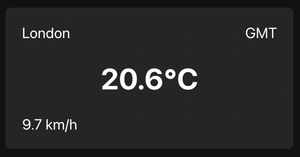

# Weather app coding challenge

## Instructions
* Use the following endpoint to get the current weather in London: 
`https://api.open-meteo.com/v1/forecast?latitude=51.51&longitude=-0.13&current_weather=true`
* Fetch the data and build the `WeatherCard` component

## Available Scripts
This project was bootstrapped with [Create React App](https://github.com/facebook/create-react-app).

In the project directory, you can run:

### `npm start`

Runs the app in the development mode.\
Open [http://localhost:3000](http://localhost:3000) to view it in the browser.

The page will reload if you make edits.\
You will also see any lint errors in the console.
